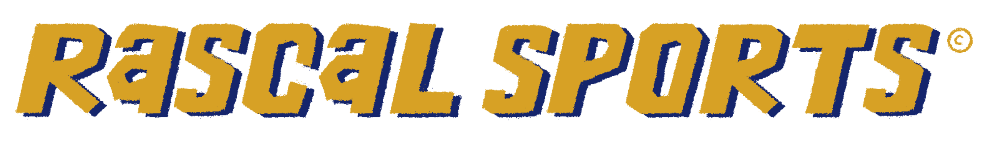

# College Football Prediction App with Chatbot:

### App Link:
https://jsandy.shinyapps.io/cfbapp/

### Current Version Notes:
* XGB Model trained through Week 11.
* Added chatbot to application.

>[!IMPORTANT]
>The Chatbot can only access data pulled on teams prompted by the users query. If you ask the Chatbot information like "Who is Duke's head coach", it will give you an outdated answer.

### Purpose:
This project acts as a start-to-finish pipeline of securing college football data from multiple sources, training an XGBoost model for point differential predictions, and creating an app which users can intuitively experiment with the model.

#### Data Ingestion Sources:
* CBS Sports' complete team rankings webpage.
* `cfbfastR` API

#### Usage:
Execute `00 runner.R` to pull/scrape data and train the models. Data will be saved to both the `downstream` folder and the `cfbapp` folder. Once this is complete, you can build the Shiny app within `app.R`

#### Coming soon:
* Altering locations of where data is saved.
* ~~Chatbot ability to read data and ML results.~~ Complete.
* ~~Dockerizing the application.~~ Complete.
* Flowchart for ths README.md

#### Coming later:
* Adding model metrics to app with new layout (mobile app?).
* Experimentation with non-tree based models and potential inclusion.